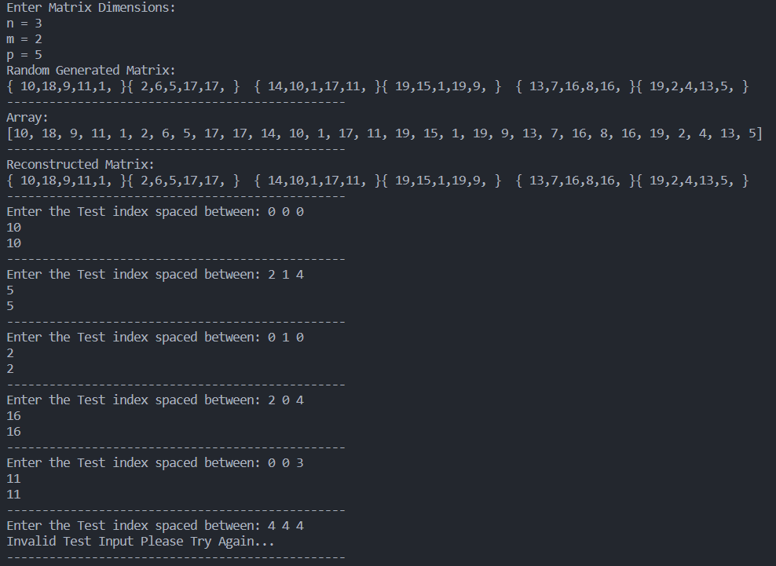

<h1 align="center" id="title">Matrix Flatten</h1>

## Description
Java program to convert 3D-matrix of user-defined dimensions as n x m x p to 1D array using simple mapping function

## Procedures
1. User enters matrix dimensions
2. generate random integers 3D matrix but with some modification the program can run more datatypes generic
3. Print the generated Matix to compare the output results from the mapping operation
4. Allocating new array to store the mapped indices and apply the mapping operation
5. Reconstruct the initial matrix from the array and compare the results
6. Then user can test by enter test cases indices from the command window spaced between to access the matrix and the array an comapre the results till the user decide to terminate the program

## Files
The program consists of only two files where one for main method and test cases and another one for the logic operation, all the program tested in terimanl and no user interface is used

## Note
- I have been using jdk-13.0.2
- No additional library has been used just only java.util for Random function generation and Scanner for user input for testing.
- Really Recommend not to rerun the program when the scanner is open due to read old data from the command window and resulting unexpected behavior on the next run and rerun by terminating the program first
- Simple user interface from the command window and some invalid input checks

## Snip from program and test some results

